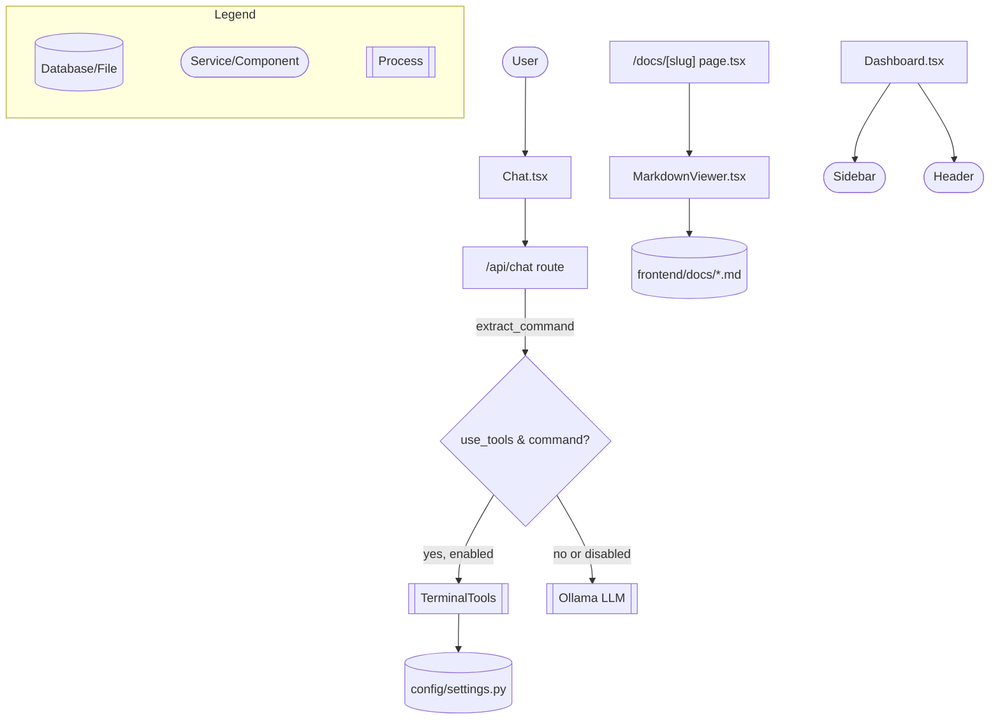

Add terminal tool chat command support, docs site, and IDE dashboard UI

<code>✨ Enhancement</code> <code>📝 Documentation</code> <code>🕐 20-40 Minutes</code>

AI Description

<dl>
<dd>
 

><pre>
>• Adds a chat-triggered terminal tool: messages prefixed with <b><i>!</i></b> or fenced bash/sh blocks are
>  executed via <b><i>TerminalTools</i></b>, gated by a new <b><i>ENABLE_TERMINAL_TOOL</i></b> setting.
>• Introduces a full Markdown-based documentation site (<b><i>/docs</i></b>) with sidebar, header, TOC, and
>  ReactMarkdown rendering, plus seed docs content.
>• Replaces the chat-only home page with a new IDE-style Dashboard layout (Sidebar/Header) and
>  updates Chat UI to render tool-call output.
>• Adds comprehensive docstrings across backend API routes and new frontend components; bundles new
>  npm dependencies and a generated <b><i>package-lock.json</i></b>.
></pre>

</dd>
</dl>

Diagram

<dl>
<dd>

 

</dd>
</dl>

 Files changed (20) <code> +3765 / -300 </code> 

<dl>
<dd>

 

Enhancement (12) <code> +850 / -280 </code>

<dl>
<dd>

routes.py<code>Add chat-triggered terminal command execution and docstrings</code> <code>+326/-156</code>

 

>Add chat-triggered terminal command execution and docstrings
>
><pre>
>• Adds extract_command() to parse &#x27;!cmd&#x27; or fenced bash/sh blocks from chat messages, executes them via TerminalTools when use_tools is set and ENABLE_TERMINAL_TOOL is on, and returns a denial message otherwise. Also adds comprehensive docstrings to all route handlers.
></pre>
>
><a href='https://github.com/clauderiks/clriks/pull/147/files#diff-ebb9bdfb1ec509be1a54fab5a4cc0458847d5214d65492f7f8d5b2621adad3c5'>backend/api/routes.py</a>

page.tsx<code>Add dynamic docs page rendering Markdown by slug</code> <code>+33/-0</code>

 

>Add dynamic docs page rendering Markdown by slug
>
><pre>
>• New route that reads a Markdown file from frontend/docs based on the URL slug and renders it via MarkdownViewer.
></pre>
>
><a href='https://github.com/clauderiks/clriks/pull/147/files#diff-b9f5f8bac33ca7acb919f023710c63891ddd0b6adde83715f12e3d3aa550f282'>frontend/app/docs/[slug]/page.tsx</a>

layout.tsx<code>Add documentation layout with header, sidebar, and TOC</code> <code>+51/-0</code>

 

>Add documentation layout with header, sidebar, and TOC
>
><pre>
>• New layout wrapping docs pages with DocsHeader, DocsSidebar, content area, and DocsTOC.
></pre>
>
><a href='https://github.com/clauderiks/clriks/pull/147/files#diff-b6f1ed197f98090ad5e8a74be07bb886644919215eabbcc51557f55edb5b007d'>frontend/app/docs/layout.tsx</a>

page.tsx<code>Replace chat home page with Dashboard component</code> <code>+2/-9</code>

 

>Replace chat home page with Dashboard component
>
><pre>
>• Home page now renders the new Dashboard layout instead of the standalone Chat component directly.
></pre>
>
><a href='https://github.com/clauderiks/clriks/pull/147/files#diff-971bce90bbbf73bd7f27b4698ef6596bfc9d2fd8cbb6995f8ed3c7f7c948541d'>frontend/app/page.tsx</a>

Chat.tsx<code>Render tool-call output and update placeholder text</code> <code>+148/-115</code>

 

>Render tool-call output and update placeholder text
>
><pre>
>• Adds ToolCall interface and renders terminal command output (stdout/stderr) returned from the backend; updates input placeholder to mention &#x27;!&#x27; command syntax and adds a component-level docstring.
></pre>
>
><a href='https://github.com/clauderiks/clriks/pull/147/files#diff-78d0a3eec24eb01715464f881793546e4a81e7edb27db6b297942cfc2265ec55'>frontend/components/Chat.tsx</a>

DocsHeader.tsx<code>Add documentation site header component</code> <code>+45/-0</code>

 

>Add documentation site header component
>
><pre>
>• New header with search input, theme toggle, and GitHub link for the docs layout.
></pre>
>
><a href='https://github.com/clauderiks/clriks/pull/147/files#diff-6f6fc1b2764ae818e1dd883edb0460d93993f9306d8067d6003d931afd40a9e7'>frontend/components/docs/DocsHeader.tsx</a>

DocsSidebar.tsx<code>Add documentation sidebar navigation</code> <code>+80/-0</code>

 

>Add documentation sidebar navigation
>
><pre>
>• New sidebar rendering grouped navigation menus (Getting Started, Developer, Security) linking to docs pages.
></pre>
>
><a href='https://github.com/clauderiks/clriks/pull/147/files#diff-cb4b8c016f05a79ca5c8282ca40374fccef55c13ee076fc8080e62857a48fda4'>frontend/components/docs/DocsSidebar.tsx</a>

DocsTOC.tsx<code>Add table of contents component for docs pages</code> <code>+56/-0</code>

 

>Add table of contents component for docs pages
>
><pre>
>• New static table-of-contents sidebar linking to page section anchors.
></pre>
>
><a href='https://github.com/clauderiks/clriks/pull/147/files#diff-c97e8814fa94b00f4a9456acf9df9f893515b0cf23f4113ab0cd8641471d1459'>frontend/components/docs/DocsTOC.tsx</a>

MarkdownViewer.tsx<code>Add Markdown renderer with GFM and heading links</code> <code>+31/-0</code>

 

>Add Markdown renderer with GFM and heading links
>
><pre>
>• New component wrapping react-markdown with remark-gfm, rehype-slug, and rehype-autolink-headings plugins.
></pre>
>
><a href='https://github.com/clauderiks/clriks/pull/147/files#diff-e96de739c6b9a74d618fc4e70fa814452613c08600e7c73929bc49d9709ca4f8'>frontend/components/docs/MarkdownViewer.tsx</a>

Header.tsx<code>Add dashboard header component</code> <code>+20/-0</code>

 

>Add dashboard header component
>
><pre>
>• New static header for the SandboxCode dashboard with navigation labels.
></pre>
>
><a href='https://github.com/clauderiks/clriks/pull/147/files#diff-9e26cbf549c2d8183f7104be45cf8c19aa9ea191bea024fead32a5f7f30389a7'>frontend/components/header/Header.tsx</a>

Dashboard.tsx<code>Add Dashboard layout combining Sidebar and Header</code> <code>+33/-0</code>

 

>Add Dashboard layout combining Sidebar and Header
>
><pre>
>• New top-level dashboard layout rendering Sidebar, Header, and a placeholder IDE content area.
></pre>
>
><a href='https://github.com/clauderiks/clriks/pull/147/files#diff-0f5a29ba98a6eea4dcd0ed334e8b6bd6f0d621023589fbf9451099a5efb98b75'>frontend/components/layout/Dashboard.tsx</a>

Sidebar.tsx<code>Add static application sidebar navigation</code> <code>+25/-0</code>

 

>Add static application sidebar navigation
>
><pre>
>• New sidebar component listing static navigation entries (Dashboard, Projects, Explorer, AI, Preview, Terminal, Git, Settings).
></pre>
>
><a href='https://github.com/clauderiks/clriks/pull/147/files#diff-8df0c5a63e8f0222a66004f7535b08d6e1580129c2bc3a2982616664c9afb6d0'>frontend/components/sidebar/Sidebar.tsx</a>

</dd>
</dl>

Documentation (4) <code> +44 / -0 </code>

<dl>
<dd>

api.md<code>Add API documentation stub</code> <code>+9/-0</code>

 

>Add API documentation stub
>
><pre>
>• New placeholder Markdown file documenting authentication and endpoints.
></pre>
>
><a href='https://github.com/clauderiks/clriks/pull/147/files#diff-1ea99a312c26e685ed41495762718769aaac89cbd051aa625c59b05da4e704e1'>frontend/docs/api.md</a>

introduction.md<code>Add getting-started introduction doc</code> <code>+14/-0</code>

 

>Add getting-started introduction doc
>
><pre>
>• New Markdown content introducing ClaudeRiks Docs features.
></pre>
>
><a href='https://github.com/clauderiks/clriks/pull/147/files#diff-478962ae74722ecb455b78afc1e9852a76658343a4569c2441700dce94213909'>frontend/docs/getting-started/introduction.md</a>

introduction.md<code>Add root introduction doc</code> <code>+14/-0</code>

 

>Add root introduction doc
>
><pre>
>• New Markdown content introducing ClaudeRiks features and getting started guidance.
></pre>
>
><a href='https://github.com/clauderiks/clriks/pull/147/files#diff-525cedba2d3fc529f6c630da7d406b9721de77c533fc8d6657e90568809248a8'>frontend/docs/introduction.md</a>

security.md<code>Add security documentation stub</code> <code>+7/-0</code>

 

>Add security documentation stub
>
><pre>
>• New placeholder Markdown file describing security practices.
></pre>
>
><a href='https://github.com/clauderiks/clriks/pull/147/files#diff-add2021dbb13e1636ec9236642281414a87ee779c0344170f2fbe6e0c08a820e'>frontend/docs/security.md</a>

</dd>
</dl>

Other (4) <code> +2871 / -20 </code>

<dl>
<dd>

settings.py<code>Add ENABLE_TERMINAL_TOOL setting</code> <code>+19/-18</code>

 

>Add ENABLE_TERMINAL_TOOL setting
>
><pre>
>• Introduces a new enable_terminal_tool boolean setting to gate terminal command execution from chat.
></pre>
>
><a href='https://github.com/clauderiks/clriks/pull/147/files#diff-4314e7383e7a3dafb3cef9aa2871fd320a1685fd2524af00b76814bddb3c0dd0'>backend/config/settings.py</a>

next-env.d.ts<code>Update generated Next.js type reference</code> <code>+2/-1</code>

 

>Update generated Next.js type reference
>
><pre>
>• Adds reference to generated route types and updates a doc URL comment; auto-generated by Next.js tooling.
></pre>
>
><a href='https://github.com/clauderiks/clriks/pull/147/files#diff-41f6c1d0c42d7e7d48b5bb119c1baa6840d7ebd94823012ae9a5400999584b9a'>frontend/next-env.d.ts</a>

package-lock.json<code>Add generated lockfile for new frontend dependencies</code> <code>+2844/-0</code>

 

>Add generated lockfile for new frontend dependencies
>
><pre>
>• New lockfile capturing axios, lucide-react, react-markdown, remark-gfm, rehype-slug, and rehype-autolink-headings plus transitive dependencies.
></pre>
>
><a href='https://github.com/clauderiks/clriks/pull/147/files#diff-4a2d9aa3e849b134993936ca81b83fb139edd2b0218077ab0f403b8c4803c62a'>frontend/package-lock.json</a>

package.json<code>Add markdown and icon dependencies</code> <code>+6/-1</code>

 

>Add markdown and icon dependencies
>
><pre>
>• Adds axios, lucide-react, react-markdown, rehype-autolink-headings, rehype-slug, and remark-gfm as dependencies to support the docs viewer and dashboard UI.
></pre>
>
><a href='https://github.com/clauderiks/clriks/pull/147/files#diff-da6498268e99511d9ba0df3c13e439d10556a812881c9d03955b2ef7c6c1c655'>frontend/package.json</a>

</dd>
</dl>

</dd>
</dl>

